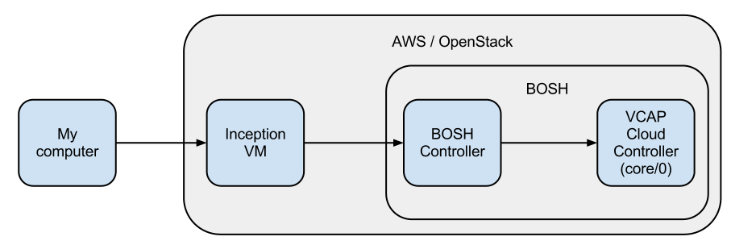
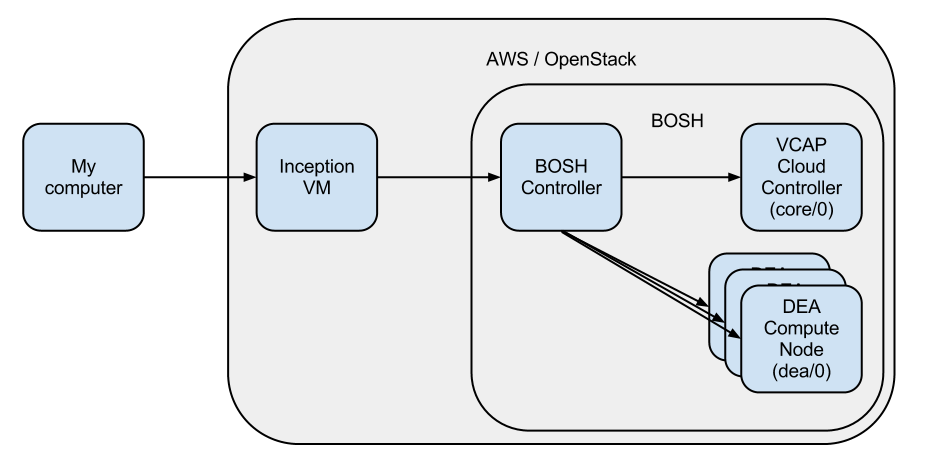

If you're new to BOSH, CloudFoundry and PaaS in general you might find this as confusing as I did. So I'll try to explain some of the concepts.

# Some resources
* [CloudFoundry documentation](http://cloudfoundry.github.com/)
* [BOSH users Mailinglist](https://groups.google.com/a/cloudfoundry.org/forum/#!forum/bosh-users)
* [CloudFoundry Mailinglist](https://groups.google.com/a/cloudfoundry.org/forum/#!forum/vcap-dev)

# Names
There are several parts in action here.

## CloudFoundry
[CloudFoundry](http://cloudfoundry.org) is VMWares's Open Source PaaS solution. It is available as a public cloud at [http://cloudfoundry.com](http://cloudfoundry.com) or as something you can bring in-house.

* __Cloud Controller__ is the main component in CloudFoundry and the server you point your vmc command to. It can be split up into separate VMs, but this bootstrap keeps it all on one node.
* __DEA__ is the compute nodes. In the initial setup the Cloud Controller is also a DEA. But you can basically view it as VMs that will handle and serve your applications. 


## BOSH
[BOSH](https://github.com/cloudfoundry/bosh) is VMWare's cloud abstraction for deploying and releasing applications. It abstracts away the underlying IaaS solution (AWS, OpenStack, VMWare) and handles requests for new nodes etc. It is a general purpose tool that packages applications and handles the distribution of "Jobs" to the nodes in the BOSH setup. In some ways you can say that it eliminates the need for Puppet/Chef, but it uses some different concepts. It also covers more, like provisioning of virtual machines.

* __Job__ is BOSH's concept of grouping functionality together. In the normal instance you can think of a Job as a composition of services that a virtual machine will have. So two virtual machines with the same Job attachet will be identical.
* __Template__ is BOSH's concept for defining a service. CloudController is one such template, and dea is another one.

## Inception VM
Inception VM is a Virtual Machine used for bootstrapping BOSH.

# Building a runnable CloudFoundry
This Bootstrap takes you throug the steps needed to have CloudFoundry running and serving requests. It launches BOSH which then is used to deploy CloudFoundry. BOSH is the only officially supported way of deploying CloudFoundry, even though Chef scripts is maintained by the community.

The way it operates is illustrated in the figure below:



1. The bosh-bootstrap gem on "My Computer" creates an Inception instance from an Ubuntu image.
2. The Inception VM creates the BOSH controller
3. The BOSH controller creates nodes for CloudFoundry
4. The BOSH controller deploys Jobs to the separate nodes

In the initial configuration the Cloud Controller acts as both a controller and a compute node where your applications run.

# Scaling
Now if the above description was crystal clear, you'll know where the scaling happens. ;) It happens to the far right. The figure below shows how everything looks when I've added a couple of compute nodes.



You can also scale out the Cloud Controller. The way BOSH handles this is with separate pools, so increasing the pool for core will scale that part out. It is the responsibility of the separate application to handle clustering and communication between the nodes.

## Implementation

```bosh cf change deas 1``` will add a resource pool and set up jobs. This is from the cf plugin to BOSH.

It adds a resource pool:

```
- name: dea
  network: default
  size: 2
  stemcell:
    name: bosh-stemcell
    version: 0.7.0
  cloud_properties:
    region: eu-west-1
    availability_zone: eu-west-1b
    instance_type: m1.large
```
Size 2 specifies to launch two virtual machines for this pool.

It then sets up a job:

```
- name: dea
  template:
  - dea
  instances: 2
  resource_pool: dea
  networks:
  - name: default
    default:
    - dns
    - gateway
```
The instances setting tells it to use two instances in the dea resource pool. For our case this matches the size of the pool exactly.    

After the changes has been done a ```bosh deploy``` will perform the needed changes to your BOSH setup.

### Using your Cloud Controller as a compute node
If you take a look at the job named "core" before you do the adding of DEAs you will see that it has a template named dea. If you leave that in the list your Cloud Controller will also be a compute node serving deployed applications.

# Tips
* Provision an Elastic IP from Amazon as early as possible and assign a DNS entry with wildcard. Example: *.cf.mydomain.com . It will take some time for the DNS to propagate (actually your old *.mydomain.com record to time out if you have one).
* If you're deploying to a different region than us-east-1 check out [this bug.](https://github.com/StarkAndWayne/bosh-cloudfoundry/issues/100) Make the changes to the configuration just before you do ```bosh deploy```.
* If you want to scale out by adding more nodes you need to tweak the FW rules. Check [this bug.](https://github.com/StarkAndWayne/bosh-cloudfoundry/issues/112)
* You might need to reduce the number og compile nodes to avoid Amazon API errors. Check [this bug.](https://github.com/StarkAndWayne/bosh-cloudfoundry/issues/111)
* If you're having problems with ```vmc push``` check out [this bug.](https://github.com/StarkAndWayne/bosh-cloudfoundry/issues/49)
* Once you're up and running [test your setup with a simple Sinatra application](http://docs.cloudfoundry.com/tools/vmc/installing-vmc.html#creating-a-simple-sinatra-application).

# TODO/Questions
* Is the BOSH controller a MicroBosh? Another name?
* What is a microbosh?
* Is the BOSH controller a part of BOSH, or something that just controls it?
* Does the core Cloud Foundry nodes scale out?
* How do you enable HA for the core?
* You run BOSH commands on the Inception VM, not BOSH Controller. Is it meant to be run on your computer? Is network the reason it isn't?
* Add some nice to know commands
* How can we lock this to a certain "release"?
* Can we describe how the source is fetched and what happens to it?
