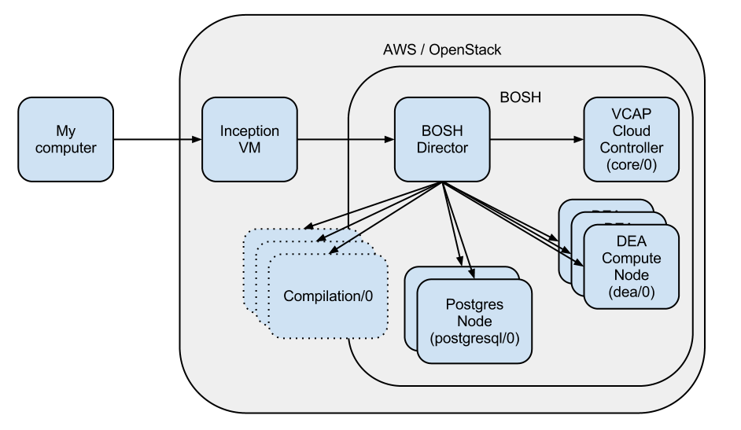

If you're new to BOSH, Cloud Foundry and PaaS in general you might find this as confusing as I did. So I'll try to explain some of the concepts.

# Some resources
Use these for some pointers for in depth understanding. The rest of the document will try to explain the basic concepts without getting into the really deep details.

## Documentation
* [Cloud Foundry documentation](http://cloudfoundry.github.com/)
* [Cloud Foundry public cloud (commercial version) docs](http://docs.cloudfoundry.com/getting-started.html)
* [Cloud Foundry community wiki](https://github.com/mrdavidlaing/cf-docs-contrib/wiki)

## Community
* [BOSH users Mailinglist](https://groups.google.com/a/cloudfoundry.org/forum/#!forum/bosh-users)
* [Cloud Foundry Mailinglist](https://groups.google.com/a/cloudfoundry.org/forum/#!forum/vcap-dev)

## Source code
* [Cloud Foundry release](https://github.com/cloudfoundry/cf-release)
* [Cloud Foundry jobs (within the release repo)](https://github.com/cloudfoundry/cf-release/tree/master/jobs)
* [Cloud Foundry VCAP (core component)](https://github.com/cloudfoundry/vcap)

# The parts
There are several parts in action here.

## Cloud Foundry

[Cloud Foundry](http://cloudfoundry.org) is a Open Source PaaS solution. It is available as a public cloud at [http://cloudfoundry.com](http://cloudfoundry.com) operated by VMWare, but it is also a solution you can bring in-house and install on your own servers, or even operate on Amazon like [AppFog](http://appfog.com) does.

* __Cloud Controller__ is the main component in Cloud Foundry and the server you point your vmc command to. It can be split up into separate VMs, but this bootstrap keeps it all on one instance.
* __DEA__ is the compute instance. In the initial setup the Cloud Controller is also a DEA. But you can basically view it as VMs that will handle and serve your applications.
* __Service__ is the concept Cloud Foundry uses to describe added functionality to your application like Postgres or MongoDB.


## BOSH 

[BOSH](https://github.com/cloudfoundry/bosh) is a cloud oriented tool chain for releasing, deployment and lifecycle management of applications. It abstracts away the underlying IaaS solution (AWS, OpenStack, VMWare) and performs requests for new virtual machines etc. It also handles the distribution of "Jobs" to the virtual machines in the BOSH setup. In some ways you can say that it eliminates the need for Puppet/Chef, but it uses some different concepts. It also covers more, like the provisioning of virtual machines.

* __Job__ is BOSH's concept of grouping functionality together. In the normal instance you can think of a Job as a composition of installed software and configuration that a virtual machine will have. So two virtual machines with the same Job attached will be identical.
* __Template__ is BOSH's concept for defining a software setup. CloudController is one such template, and dea is another one.
* __Stemcell__ is BOSH's concept for a virtual machine image. For Amazon it equals and AMI. It is a template that is booted and becoms an instance of an virtual machine.
* __Resource Pool__ is basically a collection of virtual machines, that you can reference/assign jobs to. The have the same stemcell and configuration (eg. AWS size).
* __Compilation instance__ is instances that BOSH uses when deploying a new part. At first it is used to compile everything that is needed for VCAP and DEA. If you add a template like Postgres you'll see that it compiles the components used for that. I think this is something that resembles rpm or deb packages, and that they get compiled on your Stemcells to ensure compatibility when running on your cloud.

## Inception VM
Inception VM is a Virtual Machine used for bootstrapping BOSH.

# Building a runnable Cloud Foundry
This Bootstrap takes you throug the steps needed to have Cloud Foundry running and serving requests. It launches BOSH which then is used to deploy Cloud Foundry. BOSH is the only officially supported way of deploying Cloud Foundry, even though Chef scripts is maintained by the community.

The way it operates is illustrated in the figure below:


1. The bosh-bootstrap gem on "My Computer" creates an Inception virtual machine from an Ubuntu image.
2. The Inception VM creates the BOSH controller
3. The BOSH controller creates virtual machines for Cloud Foundry
4. The BOSH controller deploys Jobs to the separate instances

In the initial configuration the Cloud Controller acts as both a controller and a compute instance where your applications run.

# Scaling
Now if the above description was crystal clear, you'll know where the scaling happens. ;) It happens to the far right. The figure below shows how everything looks when I've added a couple of compute instances.



In the case above we have three resource pools. They are called core, DEA and postgres. This is that standard way that the BOSH cf plugin does it. The following has been done here:

* ```bosh cf change deas 3``` creates a pool with 3 virtual machines and assigns the DEA job to them. It also removes the DEA template from the core job.
* ```bosh cf add service postgresql 2``` creates a pool with 2 virtual machines and assigns the postgresql job to them.
* The dotted boxes above are compile instances that BOSH will create temporarily to compile the necessary components. See the BOSH description above.

With BOSH it is possible to allocate the postgres templates on the already existing DEA instances and thus save costs on Amazon. It all comes down to what kind of scale you need, and also separation from load issues.

It is the responsibility of the separate application to handle clustering and communication between the instances.

## Implementation

```bosh cf change deas 1``` will add a resource pool and set up jobs. This is from the cf plugin to BOSH.

It adds a resource pool:

```
- name: dea
  network: default
  size: 2
  stemcell:
    name: bosh-stemcell
    version: 0.7.0
  cloud_properties:
    region: eu-west-1
    availability_zone: eu-west-1b
    instance_type: m1.large
```
Size 2 specifies to launch two virtual machines for this pool.

It then sets up a job:

```
- name: dea
  template:
  - dea
  instances: 2
  resource_pool: dea
  networks:
  - name: default
    default:
    - dns
    - gateway
```
The instances setting tells it to use two instances in the dea resource pool. For our case this matches the size of the pool exactly.    

After the changes has been done a ```bosh deploy``` will perform the needed changes to your BOSH setup.

### Using your Cloud Controller as a compute instance
If you take a look at the job named "core" before you do the adding of DEAs you will see that it has a template named dea. If you leave that in the list your Cloud Controller will also be a compute instance serving deployed applications.

# Tips
* Provision an Elastic IP from Amazon as early as possible and assign a DNS entry with wildcard. Example: *.cf.mydomain.com . It will take some time for the DNS to propagate (actually your old *.mydomain.com record to time out if you have one).
* If you're deploying to a different region than us-east-1 check out [this bug.](https://github.com/StarkAndWayne/bosh-cloudfoundry/issues/100) Make the changes to the configuration just before you do ```bosh deploy```.
* If you want to scale out by adding more instances you need to tweak the FW rules. Check [this bug.](https://github.com/StarkAndWayne/bosh-cloudfoundry/issues/112)
* You might need to reduce the number of compile instances to avoid Amazon API errors. Check [this bug.](https://github.com/StarkAndWayne/bosh-cloudfoundry/issues/111)
* If you're having problems with ```vmc push``` check out [this bug.](https://github.com/StarkAndWayne/bosh-cloudfoundry/issues/49)
* Once you're up and running [test your setup with a simple Sinatra application](http://docs.cloudfoundry.com/tools/vmc/installing-vmc.html#creating-a-simple-sinatra-application).

# TODO/Questions
* Is the BOSH controller a MicroBosh? Another name?
* What is a microbosh?
* Is the BOSH controller a part of BOSH, or something that just controls it?
* Does the core Cloud Foundry instances scale out?
* How do you enable HA for the core?
* You run BOSH commands on the Inception VM, not BOSH Controller. Is it meant to be run on your computer? Is network the reason it isn't?
* Add some nice to know commands
* How can we lock this to a certain "release"?
* Can we describe how the source is fetched and what happens to it?
